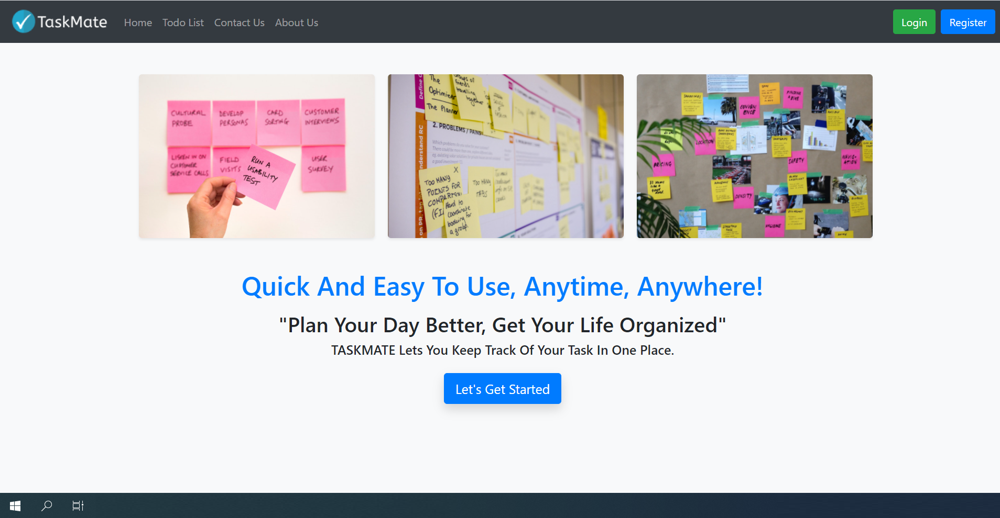
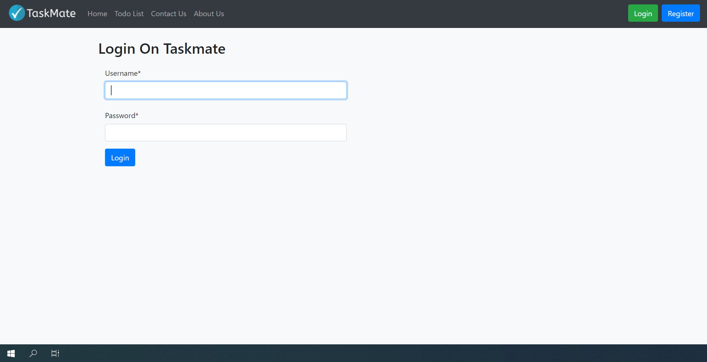
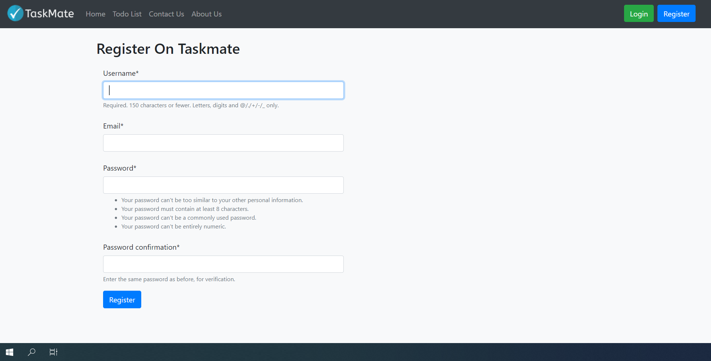
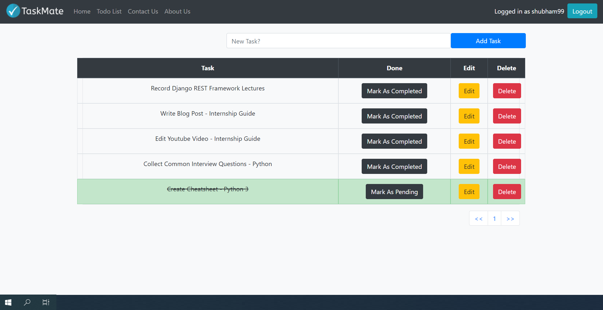

# Taskmate

Taskmate is a task manager web application build using Django Framework. The aim of this project was to understand the working of Django Framework along with it's common features like MVT architecture, working with forms, default authentication, .env files and the deployment process on Railway platform along with PostgreSQL database.

## Deployment

This project has been deployed using Railway and is accessible at:  
[https://taskmate-sm.up.railway.app/](https://taskmate-sm.up.railway.app/)

## Demo

Below are some demo images and videos showcasing the functionality of Taskmate:

<!-- Insert demo images here -->

## Features

- User registration and authentication
- Create, update, and delete tasks
- Organize tasks into lists
- Responsive and intuitive UI

## Getting Started

To run this project locally, follow these steps:

1. Clone the repository
2. Create a virtual environment and activate it
3. Install dependencies from `requirements.txt`
4. Run migrations with `python manage.py migrate`
5. Start the development server with `python manage.py runserver`

## License

This project is licensed under the MIT License.
